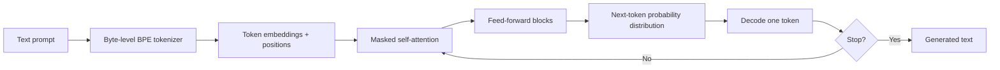

# What GPT-2 Teaches Us About Scaling Language Models

> **Series position:** 001 of 225 · **Roadmap entry:** GPT-2  
> **Evidence status:** researched from OpenAI’s release report, the GPT-2 paper, and the official repository.  
> **Experiment status:** suggested experiment; I did not execute it in this article.

## Quick Summary

| Field | Verified summary |
|---|---|
| Released | February 2019 announcement; staged release of the larger checkpoints followed in 2019 |
| Creator | OpenAI |
| Model type | Autoregressive language model |
| Architecture | Decoder-only Transformer |
| Modalities | Text input and text generation |
| Official sizes | 124M, 355M, 774M, and 1.5B parameters |
| Context | 1,024 tokens in the released GPT-2 design |
| Tokenizer | Byte-level BPE with a 50,257-token vocabulary |
| Training objective | Predict the next token in a sequence |
| Training data | WebText: text from outbound links on Reddit with at least three karma, according to the paper |
| License | The official repository is MIT-licensed; the exact terms for a particular checkpoint or downstream distribution must still be checked |
| Best use cases | Historical study, language-model research, controlled text-generation experiments |
| Biggest strength | Demonstrated that one unsupervised objective and scale could support many zero-shot behaviors |
| Biggest weakness | It is an old base model, not a modern instruction-following or safety-tuned assistant |

## Why This Model Matters

GPT-2 mattered because it made a simple proposition difficult to ignore: a model trained only to predict the next word, at enough scale and on sufficiently broad text, can acquire useful behavior without a separate supervised head for every task.

That claim needs careful wording. GPT-2 did not eliminate task-specific evaluation, and it did not become a reliable general-purpose assistant. It showed that a single decoder-only model could produce coherent text, answer some prompts, summarize, translate, and perform other tasks in a zero-shot or few-shot format. The important shift was architectural and methodological: the same language-modeling objective could be used as a general pretraining substrate.

The release also became an early public example of the governance questions that now accompany capable models. OpenAI initially released the smaller GPT-2 checkpoints and delayed the largest one while studying misuse concerns. The staged release made model publication itself part of the technical conversation.

My historical reading is that GPT-2 sits between two eras. It is more capable and more general than the task-specific NLP systems that dominated before large-scale pretraining, but it predates the instruction tuning, preference optimization, tool use, multimodality, and evaluation discipline expected of current systems.

## Historical Context

GPT-2 followed GPT, which had already shown the value of generative pretraining followed by supervised task adaptation. It also followed Transformer-based encoder systems such as BERT, which pursued bidirectional representations for language understanding. GPT-2 took a different path: keep the left-to-right generation objective and make the model and data broader.

### Timeline

| Date | Event |
|---|---|
| 2017 | The Transformer architecture is introduced in *Attention Is All You Need*. |
| 2018 | OpenAI publishes the GPT paper and releases GPT-style research code and models. |
| October 2018 | BERT demonstrates the power of bidirectional encoder pretraining for understanding tasks. |
| February 2019 | OpenAI announces GPT-2 and a staged release plan. |
| November 2019 | OpenAI releases the 1.5B GPT-2 model after the staged-release process. |
| After GPT-2 | GPT-3, instruction-tuned systems, and later chat models extend the scaling and post-training direction. |

The relationship to BERT is important. BERT is an encoder trained to create contextual representations; GPT-2 is a decoder trained to continue text. Those choices lead to different natural strengths. BERT became a foundation for classification, extraction, and retrieval features. GPT-2 became a foundation for open-ended generation.

## Architecture Explained

GPT-2 is a decoder-only Transformer. It processes a sequence from left to right. At each position, self-attention can use the earlier tokens but is masked from future tokens. The model then produces a probability distribution over the next token.



The model uses causal or masked self-attention. “Masked” here does not mean BERT-style masked-language modeling. It means that, while generating token *t*, the model cannot look at tokens after *t*. This preserves the autoregressive factorization:

\[
p(x_1,\ldots,x_n)=\prod_{t=1}^{n}p(x_t\mid x_{<t})
\]

GPT-2’s tokenizer is byte-level byte-pair encoding. The practical consequence is that the system can represent arbitrary text without requiring a separate unknown-token path for every unusual string. Tokenization still affects efficiency: code, URLs, rare words, and non-English text may consume tokens differently from ordinary English prose.

The official paper describes four sizes, from 124M to 1.5B parameters. The largest checkpoint uses 48 Transformer layers, a 1,600-dimensional residual stream, and 25 attention heads. These architectural details describe GPT-2 XL, not every GPT-2 checkpoint.

GPT-2 predates several concepts that appear in later roadmap entries. The official GPT-2 sources do not describe grouped-query attention, mixture-of-experts routing, sliding-window attention, native tool calling, or a modern long-context mechanism. Those should not be retroactively attributed to GPT-2.

## Training

GPT-2 was pretrained with next-token prediction. The paper describes WebText as a large-scale dataset assembled from outbound Reddit links meeting a karma threshold. The goal was to use documents that had received some human-curated signal without relying on a manually labeled NLP task collection.

There was no instruction-tuning stage in the GPT-2 release materials comparable to FLAN-T5, Llama 2-Chat, or later preference-optimized assistants. There is also no official GPT-2 release claim for RLHF, DPO, or GRPO. The correct description is therefore: pretrained autoregressively; downstream behavior comes from prompting, sampling, and any later community fine-tuning.

## Model Variants

The official GPT-2 family contains four sizes:

| Variant | Parameters | Practical interpretation |
|---|---:|---|
| GPT-2 Small | 124M | Fastest research and educational experiments |
| GPT-2 Medium | 355M | More capacity while remaining relatively light |
| GPT-2 Large | 774M | Stronger generation at higher memory cost |
| GPT-2 XL | 1.5B | The largest original GPT-2 checkpoint |

These are size variants of the same broad design, not separately trained task specialists. The name GPT-2 should not be confused with later community instruction-tuned derivatives.

## Capabilities

GPT-2 can generate text continuations, and prompting can elicit limited forms of summarization, question answering, translation, and style continuation. Those capabilities are emergent and prompt-sensitive rather than guaranteed interfaces.

It is not a vision, audio, embedding, reranking, or tool-calling model in the official release. It should not be described as an agent. It can produce code-like text, but the official release does not establish it as a code-specialist model.

The most educational way to view GPT-2 is as a language prior. It can produce a plausible continuation because its weights encode regularities from training text. That is not the same as grounded retrieval, factual verification, or deliberate reasoning.

## Real-World Use Cases

Supported or historically appropriate uses include:

- studying autoregressive language modeling;
- teaching tokenization, causal attention, and sampling;
- reproducing historical generation experiments;
- controlled creative-writing or completion prototypes;
- testing evaluation methods for memorization, bias, and calibration;
- comparing base-model generation with later instruction-tuned systems.

The official sources do not establish GPT-2 as appropriate for healthcare decisions, legal advice, autonomous industrial control, or unsupervised public communication. Those uses require application-specific safety and accuracy work that GPT-2 was not released as a validated system to provide.

## Practical Demo

This is a **suggested experiment**, not a reported execution:

```text
Prompt:
The operations team wanted to understand why the shipment was delayed. The first clue was

Procedure:
1. Run the same prompt with greedy decoding and with two sampling settings.
2. Record the generated continuation, token count, latency, and whether the text stays coherent.
3. Repeat with a deliberately ambiguous prompt.

Evaluation:
- Coherence: does the continuation remain grammatical and on topic?
- Repetition: does it loop or copy phrases?
- Factuality: does it invent a shipment cause?
- Reproducibility: do different seeds materially change the answer?
```

The experiment teaches an important distinction: fluent continuation is not evidence that the model knows the true shipment status. Since I did not run this experiment here, no observed result should be claimed.

## Benchmarks

The GPT-2 paper reports evaluations including language modeling perplexity and zero-shot task results. The paper’s historical contribution is not that GPT-2 became the permanent leader on every benchmark. It is that a generative language model trained without task-specific labels could perform competitively on several tasks through text prompting.

Benchmark comparisons should be read in their original setting. Prompt format, dataset version, decoding, number of shots, and evaluation harness matter. The official GPT-2 release predates modern contamination checks and today’s broader safety evaluations. A historical score should not be treated as a production-quality estimate.

## Trade-offs

**Speed and memory:** the 124M and 355M variants are accessible for local experimentation; the 1.5B model needs materially more memory and still offers much less capability than current small models.

**Latency:** autoregressive decoding produces tokens sequentially. The model does not have a native parallel text-generation mechanism.

**Context:** the 1,024-token context is small for modern document workflows.

**Licensing:** the official repository is MIT-licensed, but repository code licensing should not be casually converted into a universal legal conclusion about every model distribution or generated output. Check the exact checkpoint and intended use.

**Safety:** the model can produce biased, unsafe, or fabricated text. It has no modern instruction hierarchy or safety layer in the official base release.

## Comparison

| Model | Core design | Natural strength | Main trade-off |
|---|---|---|---|
| GPT-2 | Decoder-only Transformer | Open-ended continuation | Old base model; limited context and alignment |
| BERT | Encoder-only Transformer | Language understanding representations | Not an open-ended generator |
| T5 | Encoder–decoder Transformer | Text-to-text task transfer | More complex generation path |
| GPT-3 | Larger decoder-only successor | Scaling and few-shot prompting | Much higher compute and access requirements |

GPT-2 is best understood as a predecessor to larger decoder families, not as a direct alternative to current production assistants.

## Ecosystem

The official GPT-2 repository provides code and checkpoints. Modern users commonly load compatible checkpoints through Transformer libraries, but support details belong to the runtime and checkpoint being used. The official GPT-2 sources do not establish support for every runtime listed in the broader roadmap, so this article does not claim native support for vLLM, GGUF, MLX, ONNX, or TensorRT.

## Fine-Tuning

GPT-2 can be fine-tuned in principle and the official repository includes training guidance. LoRA, QLoRA, and PEFT are later techniques; their compatibility depends on the specific library implementation. The official GPT-2 sources do not claim that a particular adapter method is part of the original release.

## Deployment

Small checkpoints can be used for local CPU or GPU experiments. Larger checkpoints need more memory and careful batching. Cloud deployment is technically possible, but the model’s age means that “can deploy” is not the same as “should deploy.” Browser and mobile deployment are not claims made by the original release and remain outside the verified scope here.

## Limitations

- fluent output can be factually wrong;
- the model is not instruction-tuned in the modern assistant sense;
- it can reproduce biases and memorized patterns from training data;
- the context window is short by current standards;
- generation is sensitive to prompt wording and decoding;
- current framework support may require compatibility work;
- exact commercial-use terms for a particular checkpoint distribution must be checked.

## Decision Framework

Use GPT-2 when:

- you are studying the history of generative pretraining;
- you need a small, reproducible educational model;
- you want to compare base-model continuation with instruction tuning;
- your task is low-risk and evaluation is controlled.

Avoid GPT-2 when:

- the application requires reliable facts or current knowledge;
- you need long context, multimodal input, tools, or structured guarantees;
- safety, privacy, or regulatory risk is high;
- a maintained small model can meet the task more effectively.

## My Learning

Reading the official GPT-2 paper changed my understanding of what “general-purpose” meant in the early language-model era. It did not mean that the model was a dependable assistant. It meant that one pretrained generative model could express many tasks through text conditioning.

The documentation also makes the staged-release history impossible to separate from the technical story. Model capability, publication policy, misuse risk, and evaluation were already connected. GPT-2 is therefore both an architecture milestone and a reminder that release decisions are part of AI engineering.

## Key Takeaways

1. GPT-2 is a decoder-only autoregressive Transformer.
2. Its historical contribution is scale plus zero-shot prompting.
3. Fluent continuation is not factual reliability.
4. The official release predates instruction tuning and RLHF.

## Closing Question

If you have worked with GPT-2 or a similar base model, what did you learn from the gap between fluent continuation and reliable task completion?


## Extended Research Notes

> **Evidence boundary:** The notes below deepen the engineering interpretation of this article’s verified fields. They do not introduce a new benchmark score, release date, license conclusion, or deployment guarantee. Where the source record is checkpoint-specific, the same caution applies here.

### Fact, observation, and opinion

- **FACT:** Model-specific claims in this article are limited to the verified fields and the primary sources listed at the end.
- **MY OBSERVATION:** I did not execute the suggested experiment in this article, so it contains no reported experimental result from me.
- **MY OPINION:** My deployment and decision recommendations are conditional engineering judgments, not claims that the model is universally superior.
- **UNVERIFIED FIELDS:** When an official source does not establish a requested detail, the correct statement is: “This information could not be verified from official sources.”

### How to read GPT-2

GPT-2 appears at 001 of 225 in this series. That position is useful because a model is never only a list of parameters: it is a response to the research and product constraints that existed when it was released. The verified summary identifies the creator as **OpenAI**, the architecture as **Decoder-only Transformer**, the modality as **Text input and text generation**, and the release information as **February 2019 announcement; staged release of the larger checkpoints followed in 2019**. Those facts define the perimeter of the discussion. They do not, by themselves, prove that every checkpoint in the family has identical behavior.

When comparing this model with another entry, I would keep three layers separate. The first layer is the published artifact: weights, configuration, tokenizer, training objective, and model card. The second layer is the runtime: preprocessing, precision, batching, decoding, retrieval, and serving framework. The third layer is the application: prompts, tools, permissions, monitoring, and human review. A result at one layer should not be described as a property of all three. For example, a benchmark result for a base checkpoint is not automatically a guarantee for a quantized derivative inside a production workflow.

This distinction is particularly important for family names. A family may contain base models, instruction-tuned models, multimodal variants, safety models, embeddings, or adapters. The name can suggest continuity while the tokenizer, context limit, training mixture, or license changes. My working rule is therefore simple: treat the exact checkpoint and its official documentation as the unit of analysis, and use the family name only when the source explicitly supports a family-level statement.

### Architecture implications for an engineer

The architecture field says **Decoder-only Transformer**. The practical meaning depends on the interface the model exposes. An encoder-oriented system usually turns an input into representations that a task head, retriever, or classifier can consume. A decoder-oriented system usually predicts a continuation one token at a time. An encoder–decoder system separates reading from writing and uses cross-attention between the two stages. A mixture-of-experts model adds routing decisions; a state-space or recurrent model changes how sequence history is represented. These are not interchangeable labels, because they change memory use, latency, fine-tuning targets, and the kinds of errors an evaluation should expose.

The first engineering question is therefore not “How large is it?” but “What computation does the application need?” If the product needs a fixed label, token span, or embedding, open-ended generation may be unnecessary. If it needs a long response, generation is central and decoding becomes part of the latency budget. If the model accepts images, audio, video, or several input types, the preprocessing pipeline and alignment between modalities become as important as the language backbone. The article’s modality field is **Text input and text generation**; anything outside that field should be treated as an external system feature unless an official source documents it.

The second question is where the context is stored. In attention-based models, the runtime may maintain key–value states while decoding. In other architectures, recurrence, convolution, or state-space updates can change the memory pattern. The original release may not document modern optimizations such as grouped-query attention, sliding windows, paged attention, speculative decoding, or flash-attention kernels. Those optimizations can be useful in a compatible implementation, but compatibility is an implementation claim, not evidence that the original model was trained with the feature.

The third question is precision. A checkpoint can be stored or served in multiple numeric formats, but quantization changes the numerical approximation and can change output quality. I would record the original precision, the conversion tool, the quantization scheme, the runtime version, and the evaluation set. Without those fields, “the model runs locally” is not a reproducible technical result.

### Training and post-training interpretation

The verified training description names **Predict the next token in a sequence** and **WebText: text from outbound links on Reddit with at least three karma, according to the paper**. I would interpret those fields as a causal history, not as a marketing label. Pretraining determines what regularities the model can represent; instruction tuning changes how it maps a request into an answer; preference optimization changes which answers are favored; retrieval and tools add information or actions outside the weights. These stages should be reported separately because they create different failure modes.

A model can be fluent because its pretraining distribution contains many examples of a style, while still being wrong about a specific fact. It can follow a task format because instruction data taught the pattern, while still failing on an unfamiliar domain. It can produce a cited answer because a wrapper inserted retrieval, while the underlying model has not independently verified the source. A careful article therefore names the stage responsible for an observed behavior instead of attributing the whole system to the base checkpoint.

The same discipline applies to synthetic data and distillation. If an official paper documents synthetic examples, that is a property of the training recipe. If a community checkpoint uses generated data later, it is a derivative’s property. If the source does not specify the quantity, filtering, or mixture, I would not infer it from a benchmark score. The phrase “not verified from official sources” is more useful than a confident but unsupported number.

### Reproducible evaluation protocol

The practical demo in this article is marked as **suggested** unless an execution record is provided. A serious reproduction should begin with an inventory:

| Field to record | Why it matters |
|---|---|
| Exact checkpoint and revision | Family names can hide different weights and configurations. |
| Tokenizer and preprocessing | Token boundaries affect context, cost, and output. |
| Runtime and hardware | Kernels, precision, and batching affect latency and memory. |
| Prompt or input serialization | Small formatting changes can alter results. |
| Decoding or scoring settings | Greedy, sampling, beam search, and temperature answer different questions. |
| Dataset version and split | A benchmark name alone is not a reproducible test. |
| Seeds and repetitions | One sample can hide variance. |
| Human review criteria | Fluency, factuality, safety, and usefulness are different dimensions. |

For a generation model, I would evaluate at least four dimensions. **Task success** asks whether the requested transformation happened. **Faithfulness** asks whether the output stayed supported by the input or retrieved evidence. **Robustness** asks whether harmless changes in wording, ordering, or formatting cause unacceptable changes. **Safety** asks whether the system produces disallowed, private, or operationally dangerous content under realistic misuse attempts. A single aggregate score cannot replace these slices.

For an encoder, embedding, reranker, or classifier, I would add threshold calibration, class imbalance, retrieval recall, ranking quality, and performance under domain shift. For a multimodal model, I would separate perception errors from language-generation errors. For a reasoning model, I would distinguish a correct final answer from a plausible-looking explanation. The evaluation design should follow the model’s interface rather than forcing every model into a chat benchmark.

The minimum useful report is not a screenshot of one output. It is a small table containing the exact input, the output, the runtime configuration, the evaluation rubric, and the failure category. If the experiment has not been run, the article should say so plainly. A suggested experiment is a plan for learning, not evidence that the model passed.

### Deployment review

The stated best-use field is **Historical study, language-model research, controlled text-generation experiments**. Before deployment, I would translate that broad description into a bounded service contract. What inputs are accepted? What outputs are allowed? Which claims must be grounded in a source? Which actions require approval? What happens when the model refuses, times out, exceeds the context limit, or returns malformed structured output?

Memory planning should start from the exact checkpoint, numeric format, sequence length, and concurrency target. Parameter count alone is not a complete capacity estimate: runtime buffers, activations, attention state, tokenizer memory, batching, and operating-system overhead also matter. A smaller model with a long prompt and high concurrency can be harder to serve than a larger model used with short inputs. I would benchmark cold start, steady-state latency, tokens per second, peak memory, and tail latency on the actual target hardware.

The deployment mode should match the data boundary. Local or on-premises inference can reduce the need to send documents to a third party, but it does not automatically solve access control, logging, retention, or prompt injection. A hosted API can simplify scaling, but it introduces provider availability, data-processing, and pricing considerations. An edge deployment can reduce network dependence, but it makes model size, thermal limits, update mechanisms, and observability more important.

License review is a separate gate. The verified license field is **The official repository is MIT-licensed; the exact terms for a particular checkpoint or downstream distribution must still be checked**. That field should be checked against the exact weight repository, tokenizer, code, dataset terms, and any adapter or quantized artifact. “Open weights” and “commercially unrestricted” are not synonyms. If a source is ambiguous, the deployment decision should pause for legal review rather than convert uncertainty into a yes.

### Failure analysis and safety

The most useful failure taxonomy is specific to the interface. A text generator may hallucinate, repeat, follow a malicious instruction, leak memorized text, or produce unsafe advice. An encoder may encode social bias, overfit a label distribution, or become overconfident under domain shift. A vision-language model may misread small text, confuse spatial relationships, or let an image instruction override the intended task. A tool-using wrapper may execute a correct-looking but unauthorized action. These failures should be logged separately.

I would test the model with ordinary inputs, boundary inputs, and adversarial inputs. Ordinary inputs show the central task. Boundary inputs probe long sequences, rare names, code, numbers, mixed languages, missing fields, and ambiguous requests. Adversarial inputs probe prompt injection, conflicting instructions, unsafe requests, and attempts to extract hidden context. The test set should be versioned and reviewed for privacy; it should not contain sensitive production data merely because that data is convenient.

Safety is not a single layer. Model training, system prompts, input filtering, retrieval policy, tool permissions, output validation, monitoring, and human escalation each address different risks. A refusal can be useful but can also block a legitimate task; a confident answer can be helpful but can also conceal uncertainty. The right question is not whether this model is “safe” in the abstract. It is whether the complete system has controls appropriate to its users, data, and consequences.

### What I would document before publishing a result

Before turning an experiment into a LinkedIn claim, I would preserve the source links, checkpoint identifier, code revision, hardware, runtime, prompts, outputs, and evaluation rubric. I would label every sentence as one of three kinds: a **fact** directly supported by a primary source, a **my observation** from a documented experiment, or a **my opinion** about trade-offs. This separation makes the article easier to audit and prevents a plausible interpretation from being mistaken for a release fact.

I would also record what was not tested. If no benchmark was executed, say so. If only an English prompt was tried, do not generalize to multilingual behavior. If a community runtime was used, do not attribute its optimization to the original authors. If a license was not checked for a derivative, do not offer a commercial recommendation. A permanent knowledge repository is more valuable when its uncertainty is visible.

### A compact decision worksheet

| Question | Evidence to collect before choosing GPT-2 |
|---|---|
| Is the interface a match? | Official modality, input/output format, and intended-use documentation. |
| Is the quality sufficient? | Task-specific evaluation on representative, versioned data. |
| Can it fit the service budget? | Measured memory, latency, throughput, and concurrency. |
| Can it be adapted? | Official fine-tuning guidance and compatible tooling. |
| Can it be used legally? | Exact weight, code, tokenizer, data, and derivative terms. |
| Can failures be contained? | Human review, permissions, validation, monitoring, and rollback. |

My conclusion for GPT-2 should therefore remain conditional. The model is a meaningful artifact for the use cases documented in its official sources, but the right production choice depends on the exact checkpoint, data, runtime, and risk boundary. That conclusion is less dramatic than a universal ranking, yet it is more useful to an engineer deciding what to test next.

### Suggested publication checklist

- Link the official paper, repository, card, or release announcement.
- State the exact checkpoint when a family contains multiple variants.
- Keep release facts separate from observations and opinions.
- Do not transfer benchmark numbers between variants or runtimes.
- Label every unexecuted demo as suggested.
- Record tokenizer, context, precision, and decoding settings for reproductions.
- Review license and acceptable-use terms for the exact artifact.
- Explain what the model cannot do as clearly as what it can do.
- Add a successor or predecessor link only when the relationship is documented.
- Re-run the article validator after changing the file.

## Sources

- [Better Language Models and Their Implications — OpenAI](https://openai.com/index/better-language-models/)
- [Language Models are Unsupervised Multitask Learners — OpenAI PDF](https://cdn.openai.com/better-language-models/language-models.pdf)
- [GPT-2 official repository](https://github.com/openai/gpt-2)
- [The Pile — predecessor data work used by later open models](https://arxiv.org/abs/2101.00027)

## Glossary

- **Autoregressive:** predicts the next token from previous tokens.
- **BPE:** byte-pair encoding, a subword tokenization method.
- **Causal mask:** prevents a position from attending to future positions.
- **Decoder-only:** a Transformer stack designed for next-token generation.
- **Perplexity:** a language-model metric related to average predictive uncertainty.
- **Zero-shot:** attempting a task without task-specific examples in the prompt.

## Related Articles

- Next: [BERT](002-bert.md)
- Architecture thread: [T5](003-t5.md)
- Instruction-tuning thread: [FLAN-T5](004-flan-t5.md)

