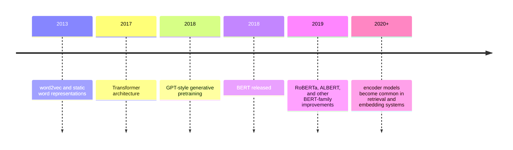

# What BERT Teaches Us About Bidirectional Language Understanding

> **Series position:** 002 of 225 · **Roadmap entry:** BERT  
> **Evidence status:** researched from the official BERT paper and Google Research repository.  
> **Experiment status:** suggested experiment; I did not execute it in this article.

## Quick Summary

| Field | Verified summary |
|---|---|
| Released | Paper submitted October 2018 |
| Creator | Google researchers: Devlin, Chang, Lee, and Toutanova |
| Model type | Pretrained language representation model |
| Architecture | Encoder-only Transformer |
| Modalities | Text |
| Official sizes | BERT-Base and BERT-Large; 110M and 340M parameters respectively |
| Context | The original released setup uses sequences up to 512 tokens |
| Tokenizer | WordPiece; the official repository describes cased and uncased checkpoints |
| Training objective | Masked-language modeling plus next-sentence prediction |
| Training data | BooksCorpus and English Wikipedia in the original paper |
| License | The official Google Research repository contains an Apache 2.0 license; verify the exact checkpoint terms in the distribution being used |
| Best use cases | Classification, token labeling, extractive QA, language representations, and retrieval features |
| Biggest strength | Deep bidirectional context for language-understanding tasks |
| Biggest weakness | It is not an open-ended text generator |

## Why This Model Matters

BERT changed the default recipe for NLP. Before BERT, teams often designed task-specific architectures or used static word vectors. BERT introduced a general pretrained encoder that could be fine-tuned for many downstream tasks with a small task-specific output layer.

The word “bidirectional” is the key. A token representation can use context on both its left and right, so the representation of “bank” can differ in “bank account” and “river bank.” GPT-2, the previous article in this series, reads left to right because it must generate. BERT is allowed to inspect both sides during pretraining because its primary job is to build representations rather than continue text.

## Historical Context



BERT built on the Transformer encoder and on earlier contextual representation work. Its timing mattered because compute, datasets, and fine-tuning practices had become capable enough for a single pretrained representation model to transfer across tasks.

## Architecture Explained

BERT is an encoder-only Transformer. During pretraining, some input tokens are hidden or replaced, and the model predicts them using the surrounding context.


The original BERT paper describes two sizes:

| Variant | Layers | Hidden size | Attention heads | Parameters |
|---|---:|---:|---:|---:|
| BERT-Base | 12 | 768 | 12 | 110M |
| BERT-Large | 24 | 1,024 | 16 | 340M |

The model uses WordPiece tokenization and segment embeddings to distinguish sentence A from sentence B in paired inputs. The original setup has a maximum sequence length of 512 tokens. BERT is not a decoder and does not use a KV cache for autoregressive generation in the way GPT-style models do.

## Training

BERT’s first pretraining objective is masked-language modeling. The model receives a corrupted sequence and predicts the original tokens at selected positions. This creates a bidirectional learning signal: the token’s representation can use both left and right context.

The second objective is next-sentence prediction. The paper describes training on sentence pairs and asking whether the second sentence follows the first in the source text. Later research questioned how much this auxiliary task contributes, but the original BERT release includes it and should be described historically rather than silently rewritten according to later variants.

The paper reports pretraining on BooksCorpus and English Wikipedia. The Google Research repository describes BERT as a general-purpose language-understanding model that can then be fine-tuned on downstream tasks such as question answering.

There is no RLHF, DPO, or instruction-tuning stage in the original BERT release. BERT is not a chat model. Any conversational behavior comes from a separate system or a later fine-tuned derivative.

## Model Variants

The official release includes cased and uncased versions of BERT-Base and BERT-Large. The uncased setup lowercases text and removes accent markers; cased checkpoints preserve case. The correct choice depends on the task. Named-entity recognition and part-of-speech tagging can benefit from case information, while many general classification tasks use uncased checkpoints.

The model family later inspired multilingual, domain-specific, compressed, and robust variants. Those are separate entries or research lines and should not be treated as official BERT-Base behavior without a source.

## Capabilities

BERT is naturally suited to:

- text classification;
- token classification such as named-entity recognition;
- extractive question answering;
- sentence-pair classification;
- contextual embeddings and retrieval features;
- semantic similarity after task-specific training.

It is not a general text generator, vision model, audio model, reranker by itself, or tool-calling agent. It can support a reranking or retrieval system after task-specific training, but “BERT is a reranker” would be an imprecise description of the base model.

## Real-World Use Cases

BERT is a good fit for supervised text classification, entity extraction, extractive question answering, and retrieval features where a task-specific head can be trained and evaluated. It should not be presented as a general-purpose chat model or as a validated system for high-stakes decisions without domain evaluation.

## Practical Demo

This is a **suggested experiment**, not a reported execution:

```text
Task: classify support tickets into billing, access, delivery, or other.

Procedure:
1. Use an official BERT checkpoint and a small labeled training set.
2. Add a classification head.
3. Fine-tune on the training split.
4. Evaluate accuracy, macro-F1, confusion matrix, and performance on misspellings.

Question:
Does bidirectional context help distinguish “locked account” from “locked shipment”? 
```

The experiment is appropriate because it evaluates understanding rather than generation. It should not be reported as an observed result unless someone actually runs it and records the environment, checkpoint, data, and metrics.

## Benchmarks

The BERT paper reports results on eleven NLP tasks, including GLUE, MultiNLI, and SQuAD. The official repository gives historical examples such as SQuAD v1.1 and natural-language-inference results. The central interpretation is transfer: a single pretrained encoder plus a small task head can achieve strong results across tasks without redesigning the entire network each time.

Those numbers are historical benchmarks. They do not establish current production quality, robustness to distribution shift, fairness, or performance on today’s datasets. Benchmark comparisons also depend on checkpoint, preprocessing, fine-tuning recipe, and evaluation split.

## Trade-offs

**Understanding versus generation:** BERT’s bidirectional encoder is a strength for representation learning and a limitation for free-form generation.

**Context length:** the original 512-token limit is small for long documents.

**Fine-tuning:** supervised task data is often needed to turn the representation into a useful application.

**Memory:** BERT-Base is relatively accessible; BERT-Large requires more memory and compute.

**Safety:** the base model can encode biases in its training data and can fail under distribution shift. A task head does not remove those risks.

**Licensing:** the repository is Apache 2.0, but the exact checkpoint and downstream artifact terms should be verified.

## Comparison

| Model | Architecture | Strongest default role | Main trade-off |
|---|---|---|---|
| GPT-2 | Decoder-only | Text continuation | Less naturally bidirectional |
| BERT | Encoder-only | Understanding and representations | Not a generator |
| T5 | Encoder–decoder | Text-to-text transformation | More compute per generated sequence |
| RoBERTa | BERT-style encoder | Improved pretraining recipe | Not the original BERT release |

## Ecosystem

The official repository provides TensorFlow code, pretrained checkpoints, and fine-tuning examples. Modern libraries can load BERT-family checkpoints, but runtime support and performance depend on the checkpoint format and framework. The original sources do not establish native support for every modern runtime, so support should be verified per deployment target.

## Fine-Tuning

BERT was designed to be fine-tuned. The common pattern is to attach a task head and update the model on labeled data. LoRA, QLoRA, PEFT, adapters, and quantized fine-tuning are later techniques; their applicability depends on the library and task rather than on the original paper.

## Deployment

BERT-Base can be deployed on CPU or modest GPU infrastructure for many classification workloads. BERT-Large needs more memory. On-premises deployment is possible with the released weights and code, but data privacy, latency, batching, and evaluation remain application concerns. Browser and mobile deployment require an optimized conversion and are not claims of the original paper.

## Limitations

- the base model does not generate reliable open-ended answers;
- representations can reflect social and factual biases in pretraining data;
- 512-token input limits long-document workflows;
- fine-tuning quality depends on labeled data and task design;
- confidence scores are not automatically calibrated;
- performance can degrade under domain shift;
- exact checkpoint licensing must be checked before commercial use.

## Decision Framework

Use BERT when:

- the task is classification, extraction, tagging, or semantic representation;
- you have labeled data or a clear fine-tuning plan;
- low-latency encoder inference matters;
- generation is not the main requirement.

Avoid BERT when:

- you need a chat assistant or long-form generator;
- the task requires current external knowledge without a retrieval system;
- long context is central and the 512-token limit is a blocker;
- you need native multimodal or tool-use behavior.

## My Learning

Reading the BERT paper changed my understanding of what a language model can be. A model does not need to generate a paragraph to be valuable. It can create a reusable contextual representation that makes many downstream tasks easier.

The contrast with GPT-2 is especially useful. GPT-2 turns context into a continuation. BERT turns context into representations that a task head can interpret. Neither is universally better; they are optimized for different interfaces.

## Key Takeaways

1. BERT is an encoder-only bidirectional Transformer.
2. Its pretraining supports downstream understanding tasks.
3. Masked-language modeling is different from autoregressive generation.
4. Fine-tuning and task-specific evaluation remain necessary.

## Closing Question

Where have you found encoder models such as BERT more useful than generative models: classification, retrieval, extraction, or another task?


## Extended Research Notes

> **Evidence boundary:** The notes below deepen the engineering interpretation of this article’s verified fields. They do not introduce a new benchmark score, release date, license conclusion, or deployment guarantee. Where the source record is checkpoint-specific, the same caution applies here.

### Fact, observation, and opinion

- **FACT:** Model-specific claims in this article are limited to the verified fields and the primary sources listed at the end.
- **MY OBSERVATION:** I did not execute the suggested experiment in this article, so it contains no reported experimental result from me.
- **MY OPINION:** My deployment and decision recommendations are conditional engineering judgments, not claims that the model is universally superior.
- **UNVERIFIED FIELDS:** When an official source does not establish a requested detail, the correct statement is: “This information could not be verified from official sources.”

### How to read BERT

BERT appears at 002 of 225 in this series. That position is useful because a model is never only a list of parameters: it is a response to the research and product constraints that existed when it was released. The verified summary identifies the creator as **Google researchers: Devlin, Chang, Lee, and Toutanova**, the architecture as **Encoder-only Transformer**, the modality as **Text**, and the release information as **Paper submitted October 2018**. Those facts define the perimeter of the discussion. They do not, by themselves, prove that every checkpoint in the family has identical behavior.

When comparing this model with another entry, I would keep three layers separate. The first layer is the published artifact: weights, configuration, tokenizer, training objective, and model card. The second layer is the runtime: preprocessing, precision, batching, decoding, retrieval, and serving framework. The third layer is the application: prompts, tools, permissions, monitoring, and human review. A result at one layer should not be described as a property of all three. For example, a benchmark result for a base checkpoint is not automatically a guarantee for a quantized derivative inside a production workflow.

This distinction is particularly important for family names. A family may contain base models, instruction-tuned models, multimodal variants, safety models, embeddings, or adapters. The name can suggest continuity while the tokenizer, context limit, training mixture, or license changes. My working rule is therefore simple: treat the exact checkpoint and its official documentation as the unit of analysis, and use the family name only when the source explicitly supports a family-level statement.

### Architecture implications for an engineer

The architecture field says **Encoder-only Transformer**. The practical meaning depends on the interface the model exposes. An encoder-oriented system usually turns an input into representations that a task head, retriever, or classifier can consume. A decoder-oriented system usually predicts a continuation one token at a time. An encoder–decoder system separates reading from writing and uses cross-attention between the two stages. A mixture-of-experts model adds routing decisions; a state-space or recurrent model changes how sequence history is represented. These are not interchangeable labels, because they change memory use, latency, fine-tuning targets, and the kinds of errors an evaluation should expose.

The first engineering question is therefore not “How large is it?” but “What computation does the application need?” If the product needs a fixed label, token span, or embedding, open-ended generation may be unnecessary. If it needs a long response, generation is central and decoding becomes part of the latency budget. If the model accepts images, audio, video, or several input types, the preprocessing pipeline and alignment between modalities become as important as the language backbone. The article’s modality field is **Text**; anything outside that field should be treated as an external system feature unless an official source documents it.

The second question is where the context is stored. In attention-based models, the runtime may maintain key–value states while decoding. In other architectures, recurrence, convolution, or state-space updates can change the memory pattern. The original release may not document modern optimizations such as grouped-query attention, sliding windows, paged attention, speculative decoding, or flash-attention kernels. Those optimizations can be useful in a compatible implementation, but compatibility is an implementation claim, not evidence that the original model was trained with the feature.

The third question is precision. A checkpoint can be stored or served in multiple numeric formats, but quantization changes the numerical approximation and can change output quality. I would record the original precision, the conversion tool, the quantization scheme, the runtime version, and the evaluation set. Without those fields, “the model runs locally” is not a reproducible technical result.

### Training and post-training interpretation

The verified training description names **Masked-language modeling plus next-sentence prediction** and **BooksCorpus and English Wikipedia in the original paper**. I would interpret those fields as a causal history, not as a marketing label. Pretraining determines what regularities the model can represent; instruction tuning changes how it maps a request into an answer; preference optimization changes which answers are favored; retrieval and tools add information or actions outside the weights. These stages should be reported separately because they create different failure modes.

A model can be fluent because its pretraining distribution contains many examples of a style, while still being wrong about a specific fact. It can follow a task format because instruction data taught the pattern, while still failing on an unfamiliar domain. It can produce a cited answer because a wrapper inserted retrieval, while the underlying model has not independently verified the source. A careful article therefore names the stage responsible for an observed behavior instead of attributing the whole system to the base checkpoint.

The same discipline applies to synthetic data and distillation. If an official paper documents synthetic examples, that is a property of the training recipe. If a community checkpoint uses generated data later, it is a derivative’s property. If the source does not specify the quantity, filtering, or mixture, I would not infer it from a benchmark score. The phrase “not verified from official sources” is more useful than a confident but unsupported number.

### Reproducible evaluation protocol

The practical demo in this article is marked as **suggested** unless an execution record is provided. A serious reproduction should begin with an inventory:

| Field to record | Why it matters |
|---|---|
| Exact checkpoint and revision | Family names can hide different weights and configurations. |
| Tokenizer and preprocessing | Token boundaries affect context, cost, and output. |
| Runtime and hardware | Kernels, precision, and batching affect latency and memory. |
| Prompt or input serialization | Small formatting changes can alter results. |
| Decoding or scoring settings | Greedy, sampling, beam search, and temperature answer different questions. |
| Dataset version and split | A benchmark name alone is not a reproducible test. |
| Seeds and repetitions | One sample can hide variance. |
| Human review criteria | Fluency, factuality, safety, and usefulness are different dimensions. |

For a generation model, I would evaluate at least four dimensions. **Task success** asks whether the requested transformation happened. **Faithfulness** asks whether the output stayed supported by the input or retrieved evidence. **Robustness** asks whether harmless changes in wording, ordering, or formatting cause unacceptable changes. **Safety** asks whether the system produces disallowed, private, or operationally dangerous content under realistic misuse attempts. A single aggregate score cannot replace these slices.

For an encoder, embedding, reranker, or classifier, I would add threshold calibration, class imbalance, retrieval recall, ranking quality, and performance under domain shift. For a multimodal model, I would separate perception errors from language-generation errors. For a reasoning model, I would distinguish a correct final answer from a plausible-looking explanation. The evaluation design should follow the model’s interface rather than forcing every model into a chat benchmark.

The minimum useful report is not a screenshot of one output. It is a small table containing the exact input, the output, the runtime configuration, the evaluation rubric, and the failure category. If the experiment has not been run, the article should say so plainly. A suggested experiment is a plan for learning, not evidence that the model passed.

### Deployment review

The stated best-use field is **Classification, token labeling, extractive QA, language representations, and retrieval features**. Before deployment, I would translate that broad description into a bounded service contract. What inputs are accepted? What outputs are allowed? Which claims must be grounded in a source? Which actions require approval? What happens when the model refuses, times out, exceeds the context limit, or returns malformed structured output?

Memory planning should start from the exact checkpoint, numeric format, sequence length, and concurrency target. Parameter count alone is not a complete capacity estimate: runtime buffers, activations, attention state, tokenizer memory, batching, and operating-system overhead also matter. A smaller model with a long prompt and high concurrency can be harder to serve than a larger model used with short inputs. I would benchmark cold start, steady-state latency, tokens per second, peak memory, and tail latency on the actual target hardware.

The deployment mode should match the data boundary. Local or on-premises inference can reduce the need to send documents to a third party, but it does not automatically solve access control, logging, retention, or prompt injection. A hosted API can simplify scaling, but it introduces provider availability, data-processing, and pricing considerations. An edge deployment can reduce network dependence, but it makes model size, thermal limits, update mechanisms, and observability more important.

License review is a separate gate. The verified license field is **The official Google Research repository contains an Apache 2.0 license; verify the exact checkpoint terms in the distribution being used**. That field should be checked against the exact weight repository, tokenizer, code, dataset terms, and any adapter or quantized artifact. “Open weights” and “commercially unrestricted” are not synonyms. If a source is ambiguous, the deployment decision should pause for legal review rather than convert uncertainty into a yes.

### Failure analysis and safety

The most useful failure taxonomy is specific to the interface. A text generator may hallucinate, repeat, follow a malicious instruction, leak memorized text, or produce unsafe advice. An encoder may encode social bias, overfit a label distribution, or become overconfident under domain shift. A vision-language model may misread small text, confuse spatial relationships, or let an image instruction override the intended task. A tool-using wrapper may execute a correct-looking but unauthorized action. These failures should be logged separately.

I would test the model with ordinary inputs, boundary inputs, and adversarial inputs. Ordinary inputs show the central task. Boundary inputs probe long sequences, rare names, code, numbers, mixed languages, missing fields, and ambiguous requests. Adversarial inputs probe prompt injection, conflicting instructions, unsafe requests, and attempts to extract hidden context. The test set should be versioned and reviewed for privacy; it should not contain sensitive production data merely because that data is convenient.

Safety is not a single layer. Model training, system prompts, input filtering, retrieval policy, tool permissions, output validation, monitoring, and human escalation each address different risks. A refusal can be useful but can also block a legitimate task; a confident answer can be helpful but can also conceal uncertainty. The right question is not whether this model is “safe” in the abstract. It is whether the complete system has controls appropriate to its users, data, and consequences.

### What I would document before publishing a result

Before turning an experiment into a LinkedIn claim, I would preserve the source links, checkpoint identifier, code revision, hardware, runtime, prompts, outputs, and evaluation rubric. I would label every sentence as one of three kinds: a **fact** directly supported by a primary source, a **my observation** from a documented experiment, or a **my opinion** about trade-offs. This separation makes the article easier to audit and prevents a plausible interpretation from being mistaken for a release fact.

I would also record what was not tested. If no benchmark was executed, say so. If only an English prompt was tried, do not generalize to multilingual behavior. If a community runtime was used, do not attribute its optimization to the original authors. If a license was not checked for a derivative, do not offer a commercial recommendation. A permanent knowledge repository is more valuable when its uncertainty is visible.

### A compact decision worksheet

| Question | Evidence to collect before choosing BERT |
|---|---|
| Is the interface a match? | Official modality, input/output format, and intended-use documentation. |
| Is the quality sufficient? | Task-specific evaluation on representative, versioned data. |
| Can it fit the service budget? | Measured memory, latency, throughput, and concurrency. |
| Can it be adapted? | Official fine-tuning guidance and compatible tooling. |
| Can it be used legally? | Exact weight, code, tokenizer, data, and derivative terms. |
| Can failures be contained? | Human review, permissions, validation, monitoring, and rollback. |

My conclusion for BERT should therefore remain conditional. The model is a meaningful artifact for the use cases documented in its official sources, but the right production choice depends on the exact checkpoint, data, runtime, and risk boundary. That conclusion is less dramatic than a universal ranking, yet it is more useful to an engineer deciding what to test next.

### Suggested publication checklist

- Link the official paper, repository, card, or release announcement.
- State the exact checkpoint when a family contains multiple variants.
- Keep release facts separate from observations and opinions.
- Do not transfer benchmark numbers between variants or runtimes.
- Label every unexecuted demo as suggested.
- Record tokenizer, context, precision, and decoding settings for reproductions.
- Review license and acceptable-use terms for the exact artifact.
- Explain what the model cannot do as clearly as what it can do.
- Add a successor or predecessor link only when the relationship is documented.
- Re-run the article validator after changing the file.

## Sources

- [BERT paper](https://arxiv.org/abs/1810.04805)
- [Google Research BERT repository](https://github.com/google-research/bert)
- [Transformer paper](https://arxiv.org/abs/1706.03762)
- [RoBERTa paper](https://arxiv.org/abs/1907.11692)

## Glossary

- **Encoder-only:** Transformer stack that creates contextual representations.
- **Masked-language modeling:** predict tokens hidden or corrupted in the input.
- **WordPiece:** subword tokenizer used by the original BERT release.
- **Fine-tuning:** updating pretrained weights for a downstream task.
- **Task head:** small output layer specialized for classification or extraction.

## Related Articles

- Previous: [GPT-2](001-gpt2.md)
- Next: [T5](003-t5.md)
- Instruction-tuning successor: [FLAN-T5](004-flan-t5.md)
