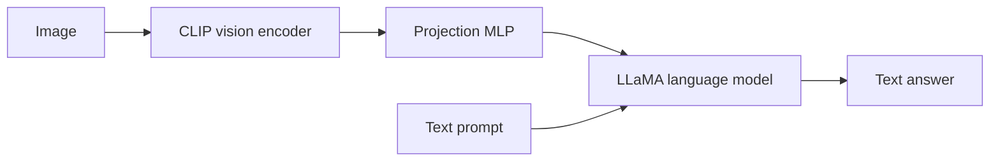

# What LLaVA 1.5 Teaches Us About Building a Visual Assistant

> **Series position:** 192 of 225 · **Roadmap entry:** LLaVA 1.5. **Evidence status:** official paper and repository. **Experiment status:** suggested, not executed.

## Quick Summary

| Field | Verified summary |
|---|---|
| Released | October 2023 paper/release |
| Creator | LLaVA research team |
| Model type | Open visual-language assistant |
| Architecture | CLIP vision encoder, projection layer, and LLaMA-family language model |
| Parameters | 7B and 13B language-model variants are reported |
| Modalities | Image input and text output |
| Training | Feature alignment followed by visual instruction tuning |
| License | Depends on language model, vision encoder, and released checkpoint terms |
| Best use cases | Image Q&A, visual instruction following, and VLM research |

## Why This Model Matters

LLaVA 1.5 showed that a relatively simple visual-language connector plus better data could produce a useful open multimodal assistant. It became a reference architecture for many later VLMs.

## Historical Context

It builds on LLaVA 1.0 and competes with BLIP-2, InstructBLIP, Qwen-VL, and closed multimodal APIs.

## Architecture Explained

The vision encoder turns image patches into features. A projector maps them into the language model’s input space, allowing the decoder to generate text conditioned on visual tokens.

## Training

The paper describes a two-stage recipe: feature alignment and visual instruction tuning. The work uses image-text data and instruction examples; it is not RLHF by default.

## Model Variants

LLaVA-1.5-7B and 13B are the primary variants. Checkpoint backbones and terms should be verified before redistribution.

## Capabilities

Image description, visual question answering, OCR-like interpretation, and instruction following are documented. Exact OCR and chart performance depend on image quality and checkpoint.

## Real-World Use Cases

Use it for image Q&A, education, prototyping, document screenshots, and VLM research. Do not use it as a sole medical or safety inspector.

## Practical Demo

**Suggested experiment; not executed:** evaluate 50 images containing text, charts, and objects. Compare answer accuracy, OCR character error, hallucination rate, and sensitivity to image resizing.

## Benchmarks

The paper reports MME, MMBench, ScienceQA, and related evaluations. Benchmark results measure specific visual tasks and do not establish reliable perception in production.

## Trade-offs

Open weights support local research, but visual tokens increase memory and latency. Language-model and vision-model licenses must be read together.

## Comparison

| Model | Difference |
|---|---|
| LLaVA 1.0 | Earlier alignment recipe |
| LLaVA 1.5 | Stronger data/projector recipe |
| [193 — LLaVA 1.6](193-llava-1-6.md) | Higher-resolution/next-generation line |
| BLIP-2 | Alternative connector architecture |

## Ecosystem

The official LLaVA repository provides inference and training code. Transformers, vLLM, and quantized support depend on the exact checkpoint and image-processing path.

## Fine-Tuning

Visual instruction tuning can update the projector and language model. LoRA/PEFT is useful when GPU memory is limited; preserve image preprocessing.

## Deployment

Use a GPU for comfortable local inference. Validate image size, prompt format, unsafe image handling, and output before downstream action.

## Limitations

LLaVA may hallucinate visual details, misread text, fail on small objects, and over-trust language priors. It does not provide calibrated uncertainty by default.

## Decision Framework

Use it when:

- you need an open VLM baseline;
- image Q&A is narrow and testable;
- local experimentation matters.

Avoid it when:

- OCR accuracy is mission-critical without a verifier;
- images contain sensitive data without controls;
- you need video or audio support.

## My Learning

LLaVA 1.5 made the connector layer memorable: multimodality is not magic fusion; it is an interface between visual features and a language model.

## Key Takeaways

1. LLaVA 1.5 combines CLIP, a projector, and a LLaMA-family decoder.
2. Training has alignment and visual-instruction stages.
3. Visual answers still need perception checks.
4. Licenses may come from multiple components.

## Closing Question

What visual failure would be most costly in your application: missed text, wrong objects, or invented details?

## Glossary

- **Projector:** maps vision features into language-model input space.
- **Visual instruction tuning:** supervised tuning on image/text instructions.
- **Visual token:** language-model input representation derived from an image.

## Extended Research Notes

> **Evidence boundary:** The notes below deepen the engineering interpretation of this article’s verified fields. They do not introduce a new benchmark score, release date, license conclusion, or deployment guarantee. Where the source record is checkpoint-specific, the same caution applies here.

### Fact, observation, and opinion

- **FACT:** Model-specific claims in this article are limited to the verified fields and the primary sources listed at the end.
- **MY OBSERVATION:** I did not execute the suggested experiment in this article, so it contains no reported experimental result from me.
- **MY OPINION:** My deployment and decision recommendations are conditional engineering judgments, not claims that the model is universally superior.
- **UNVERIFIED FIELDS:** When an official source does not establish a requested detail, the correct statement is: “This information could not be verified from official sources.”

### How to read LLaVA 1.5

LLaVA 1.5 appears at 192 of 225 in this series. That position is useful because a model is never only a list of parameters: it is a response to the research and product constraints that existed when it was released. The verified summary identifies the creator as **LLaVA research team**, the architecture as **CLIP vision encoder, projection layer, and LLaMA-family language model**, the modality as **Image input and text output**, and the release information as **October 2023 paper/release**. Those facts define the perimeter of the discussion. They do not, by themselves, prove that every checkpoint in the family has identical behavior.

When comparing this model with another entry, I would keep three layers separate. The first layer is the published artifact: weights, configuration, tokenizer, training objective, and model card. The second layer is the runtime: preprocessing, precision, batching, decoding, retrieval, and serving framework. The third layer is the application: prompts, tools, permissions, monitoring, and human review. A result at one layer should not be described as a property of all three. For example, a benchmark result for a base checkpoint is not automatically a guarantee for a quantized derivative inside a production workflow.

This distinction is particularly important for family names. A family may contain base models, instruction-tuned models, multimodal variants, safety models, embeddings, or adapters. The name can suggest continuity while the tokenizer, context limit, training mixture, or license changes. My working rule is therefore simple: treat the exact checkpoint and its official documentation as the unit of analysis, and use the family name only when the source explicitly supports a family-level statement.

### Architecture implications for an engineer

The architecture field says **CLIP vision encoder, projection layer, and LLaMA-family language model**. The practical meaning depends on the interface the model exposes. An encoder-oriented system usually turns an input into representations that a task head, retriever, or classifier can consume. A decoder-oriented system usually predicts a continuation one token at a time. An encoder–decoder system separates reading from writing and uses cross-attention between the two stages. A mixture-of-experts model adds routing decisions; a state-space or recurrent model changes how sequence history is represented. These are not interchangeable labels, because they change memory use, latency, fine-tuning targets, and the kinds of errors an evaluation should expose.

The first engineering question is therefore not “How large is it?” but “What computation does the application need?” If the product needs a fixed label, token span, or embedding, open-ended generation may be unnecessary. If it needs a long response, generation is central and decoding becomes part of the latency budget. If the model accepts images, audio, video, or several input types, the preprocessing pipeline and alignment between modalities become as important as the language backbone. The article’s modality field is **Image input and text output**; anything outside that field should be treated as an external system feature unless an official source documents it.

The second question is where the context is stored. In attention-based models, the runtime may maintain key–value states while decoding. In other architectures, recurrence, convolution, or state-space updates can change the memory pattern. The original release may not document modern optimizations such as grouped-query attention, sliding windows, paged attention, speculative decoding, or flash-attention kernels. Those optimizations can be useful in a compatible implementation, but compatibility is an implementation claim, not evidence that the original model was trained with the feature.

The third question is precision. A checkpoint can be stored or served in multiple numeric formats, but quantization changes the numerical approximation and can change output quality. I would record the original precision, the conversion tool, the quantization scheme, the runtime version, and the evaluation set. Without those fields, “the model runs locally” is not a reproducible technical result.

### Training and post-training interpretation

The verified training description names **Feature alignment followed by visual instruction tuning** and **not stated in the article’s verified summary**. I would interpret those fields as a causal history, not as a marketing label. Pretraining determines what regularities the model can represent; instruction tuning changes how it maps a request into an answer; preference optimization changes which answers are favored; retrieval and tools add information or actions outside the weights. These stages should be reported separately because they create different failure modes.

A model can be fluent because its pretraining distribution contains many examples of a style, while still being wrong about a specific fact. It can follow a task format because instruction data taught the pattern, while still failing on an unfamiliar domain. It can produce a cited answer because a wrapper inserted retrieval, while the underlying model has not independently verified the source. A careful article therefore names the stage responsible for an observed behavior instead of attributing the whole system to the base checkpoint.

The same discipline applies to synthetic data and distillation. If an official paper documents synthetic examples, that is a property of the training recipe. If a community checkpoint uses generated data later, it is a derivative’s property. If the source does not specify the quantity, filtering, or mixture, I would not infer it from a benchmark score. The phrase “not verified from official sources” is more useful than a confident but unsupported number.

### Reproducible evaluation protocol

The practical demo in this article is marked as **suggested** unless an execution record is provided. A serious reproduction should begin with an inventory:

| Field to record | Why it matters |
|---|---|
| Exact checkpoint and revision | Family names can hide different weights and configurations. |
| Tokenizer and preprocessing | Token boundaries affect context, cost, and output. |
| Runtime and hardware | Kernels, precision, and batching affect latency and memory. |
| Prompt or input serialization | Small formatting changes can alter results. |
| Decoding or scoring settings | Greedy, sampling, beam search, and temperature answer different questions. |
| Dataset version and split | A benchmark name alone is not a reproducible test. |
| Seeds and repetitions | One sample can hide variance. |
| Human review criteria | Fluency, factuality, safety, and usefulness are different dimensions. |

For a generation model, I would evaluate at least four dimensions. **Task success** asks whether the requested transformation happened. **Faithfulness** asks whether the output stayed supported by the input or retrieved evidence. **Robustness** asks whether harmless changes in wording, ordering, or formatting cause unacceptable changes. **Safety** asks whether the system produces disallowed, private, or operationally dangerous content under realistic misuse attempts. A single aggregate score cannot replace these slices.

For an encoder, embedding, reranker, or classifier, I would add threshold calibration, class imbalance, retrieval recall, ranking quality, and performance under domain shift. For a multimodal model, I would separate perception errors from language-generation errors. For a reasoning model, I would distinguish a correct final answer from a plausible-looking explanation. The evaluation design should follow the model’s interface rather than forcing every model into a chat benchmark.

The minimum useful report is not a screenshot of one output. It is a small table containing the exact input, the output, the runtime configuration, the evaluation rubric, and the failure category. If the experiment has not been run, the article should say so plainly. A suggested experiment is a plan for learning, not evidence that the model passed.

### Deployment review

The stated best-use field is **Image Q&A, visual instruction following, and VLM research**. Before deployment, I would translate that broad description into a bounded service contract. What inputs are accepted? What outputs are allowed? Which claims must be grounded in a source? Which actions require approval? What happens when the model refuses, times out, exceeds the context limit, or returns malformed structured output?

Memory planning should start from the exact checkpoint, numeric format, sequence length, and concurrency target. Parameter count alone is not a complete capacity estimate: runtime buffers, activations, attention state, tokenizer memory, batching, and operating-system overhead also matter. A smaller model with a long prompt and high concurrency can be harder to serve than a larger model used with short inputs. I would benchmark cold start, steady-state latency, tokens per second, peak memory, and tail latency on the actual target hardware.

The deployment mode should match the data boundary. Local or on-premises inference can reduce the need to send documents to a third party, but it does not automatically solve access control, logging, retention, or prompt injection. A hosted API can simplify scaling, but it introduces provider availability, data-processing, and pricing considerations. An edge deployment can reduce network dependence, but it makes model size, thermal limits, update mechanisms, and observability more important.

License review is a separate gate. The verified license field is **Depends on language model, vision encoder, and released checkpoint terms**. That field should be checked against the exact weight repository, tokenizer, code, dataset terms, and any adapter or quantized artifact. “Open weights” and “commercially unrestricted” are not synonyms. If a source is ambiguous, the deployment decision should pause for legal review rather than convert uncertainty into a yes.

### Failure analysis and safety

The most useful failure taxonomy is specific to the interface. A text generator may hallucinate, repeat, follow a malicious instruction, leak memorized text, or produce unsafe advice. An encoder may encode social bias, overfit a label distribution, or become overconfident under domain shift. A vision-language model may misread small text, confuse spatial relationships, or let an image instruction override the intended task. A tool-using wrapper may execute a correct-looking but unauthorized action. These failures should be logged separately.

I would test the model with ordinary inputs, boundary inputs, and adversarial inputs. Ordinary inputs show the central task. Boundary inputs probe long sequences, rare names, code, numbers, mixed languages, missing fields, and ambiguous requests. Adversarial inputs probe prompt injection, conflicting instructions, unsafe requests, and attempts to extract hidden context. The test set should be versioned and reviewed for privacy; it should not contain sensitive production data merely because that data is convenient.

Safety is not a single layer. Model training, system prompts, input filtering, retrieval policy, tool permissions, output validation, monitoring, and human escalation each address different risks. A refusal can be useful but can also block a legitimate task; a confident answer can be helpful but can also conceal uncertainty. The right question is not whether this model is “safe” in the abstract. It is whether the complete system has controls appropriate to its users, data, and consequences.

### What I would document before publishing a result

Before turning an experiment into a LinkedIn claim, I would preserve the source links, checkpoint identifier, code revision, hardware, runtime, prompts, outputs, and evaluation rubric. I would label every sentence as one of three kinds: a **fact** directly supported by a primary source, a **my observation** from a documented experiment, or a **my opinion** about trade-offs. This separation makes the article easier to audit and prevents a plausible interpretation from being mistaken for a release fact.

I would also record what was not tested. If no benchmark was executed, say so. If only an English prompt was tried, do not generalize to multilingual behavior. If a community runtime was used, do not attribute its optimization to the original authors. If a license was not checked for a derivative, do not offer a commercial recommendation. A permanent knowledge repository is more valuable when its uncertainty is visible.

### A compact decision worksheet

| Question | Evidence to collect before choosing LLaVA 1.5 |
|---|---|
| Is the interface a match? | Official modality, input/output format, and intended-use documentation. |
| Is the quality sufficient? | Task-specific evaluation on representative, versioned data. |
| Can it fit the service budget? | Measured memory, latency, throughput, and concurrency. |
| Can it be adapted? | Official fine-tuning guidance and compatible tooling. |
| Can it be used legally? | Exact weight, code, tokenizer, data, and derivative terms. |
| Can failures be contained? | Human review, permissions, validation, monitoring, and rollback. |

My conclusion for LLaVA 1.5 should therefore remain conditional. The model is a meaningful artifact for the use cases documented in its official sources, but the right production choice depends on the exact checkpoint, data, runtime, and risk boundary. That conclusion is less dramatic than a universal ranking, yet it is more useful to an engineer deciding what to test next.

### Suggested publication checklist

- Link the official paper, repository, card, or release announcement.
- State the exact checkpoint when a family contains multiple variants.
- Keep release facts separate from observations and opinions.
- Do not transfer benchmark numbers between variants or runtimes.
- Label every unexecuted demo as suggested.
- Record tokenizer, context, precision, and decoding settings for reproductions.
- Review license and acceptable-use terms for the exact artifact.
- Explain what the model cannot do as clearly as what it can do.
- Add a successor or predecessor link only when the relationship is documented.
- Re-run the article validator after changing the file.

## Sources

- [LLaVA 1.5 paper](https://arxiv.org/abs/2310.03744)
- [Official LLaVA repository](https://github.com/haotian-liu/LLaVA)

## Related Articles

- Previous: [191 — Command enterprise/API models](191-command-enterprise-api-models.md)
- Next: [193 — LLaVA 1.6](193-llava-1-6.md)

